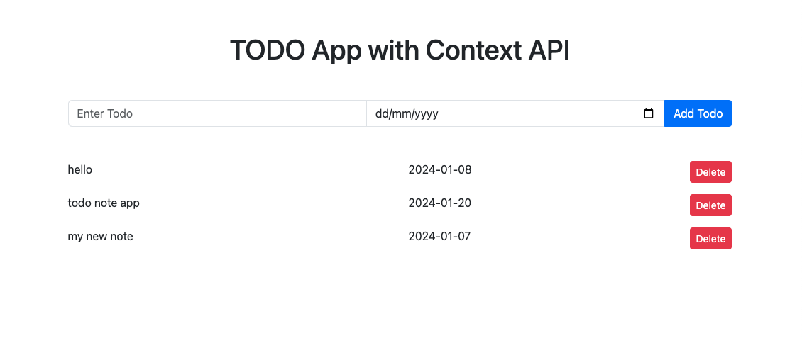

This is a todo app using react context api.

This web app using dependencies are:
```bash
"bootstrap": "^5.3.1",
"next": "14.0.4"
```

Application functionality are:
- Create new note
- Delete note
- Context API

## Getting Started
Highly recommended use chrome browser.

1. First download the code and run:
```bash
npm install
```

2. Run the development server:
```bash
npm run dev
# or
yarn dev
# or
pnpm dev
```

Open [http://localhost:3000](http://localhost:3000) with your browser to see the result.

## NextJs-Auth-Note-App view

